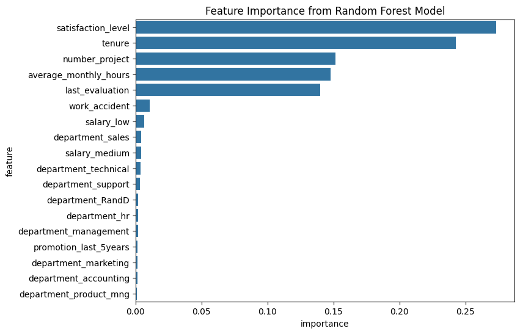

# Salifort Motors - Employee Attrition Prediction

**Project:** Capstone for the Google Advanced Data Analytics Certificate

## 1. Project Overview

This project analyzes a dataset from Salifort Motors, a fictional alternative energy vehicle manufacturer, to understand the key drivers of employee attrition. The primary goal is to build a predictive machine learning model that can identify employees at risk of leaving. The insights derived from this analysis are intended to help the Human Resources (HR) department develop proactive retention strategies.

This project follows the **PACE (Plan, Analyze, Construct, Execute)** framework.

## 2. Business Problem

High employee turnover presents a significant challenge, leading to increased recruitment costs, loss of institutional knowledge, and decreased team morale. Salifort Motors' senior leadership requires a data-driven approach to identify the root causes of attrition and mitigate its impact.

**Key Question:** What are the most significant factors that influence an employee's decision to leave Salifort Motors?

## 3. Data Analysis (EDA)

Exploratory Data Analysis was performed to uncover patterns and test initial hypotheses.

### Key Findings from EDA:

- **Satisfaction is Critical:** There is a strong negative correlation between `satisfaction_level` and attrition. A large portion of employees who left had very low satisfaction scores.
- **The "Frustrated Star" Archetype:** A significant cluster of employees who left had **low satisfaction** but **high performance evaluations**. This group represents high-value talent at risk due to potential burnout or lack of recognition.
- **3-5 Year:** Employee attrition peaks significantly for those with 3 to 5 years of tenure at the company. Employees who surpass the 6-year mark are far more likely to stay.
- **Workload Imbalance:** Attrition is high for employees who are either overworked (6-7 projects, >250 monthly hours) or under-utilized (2 projects).

### Key Visualization: Feature Importance

The predictive model identified the following features as most important for predicting attrition:



## 4. Modeling and Evaluation

A **Random Forest Classifier** was selected for this task due to its high performance and ability to handle complex, non-linear relationships in the data.

### Model Performance:

The model achieved the following results on the unseen test data:
- **Accuracy:** ~98.5%
- **Precision (for 'Left'):** 99%
- **Recall (for 'Left'):** 96%

The high **Recall** score is particularly important, as it indicates the model is highly effective at its primary business goal: correctly identifying the vast majority of employees who are at risk of leaving.

## 5. Actionable Recommendations

Based on the analysis, the following recommendations are proposed for Salifort Motors' HR department and leadership:

1.  **Implement a Proactive Alert System:** Use this model to flag at-risk employees. This allows HR to initiate confidential "stay interviews" to address concerns before an employee decides to resign.
2.  **Target the High-Risk Tenure Window:** Develop specific career pathing, mentorship, and engagement programs for employees with 3-5 years of service.
3.  **Conduct Workload and Role Audits:** For flagged employees, especially the "frustrated stars," managers should review workloads and role responsibilities to prevent burnout and ensure proper recognition.
4.  **Empower Managers with Data:** Equip managers with insights about their teams' satisfaction levels to foster a more supportive and responsive work environment.

## 6. How to Run This Project

1.  Clone this repository to your local machine:
    ```bash
    git clone https://github.com/YOUR_USERNAME/Google-Advanced-Data-Analytics-Capstone-Project.git
    ```
2.  Navigate to the project directory:
    ```bash
    cd Google-Advanced-Data-Analytics-Capstone-Project
    ```
3.  Create and activate a virtual environment:
    ```bash
    python -m venv venv
    source venv/bin/activate  # On Windows, use `venv\Scripts\activate`
    ```
4.  Install the required packages:
    ```bash
    pip install -r requirements.txt
    ```
5.  Launch Jupyter and open the `hr_analysis.ipynb` notebook:
    ```bash
    jupyter notebook
    ```